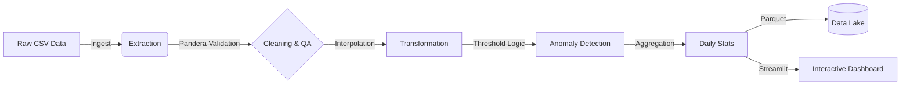

# 🏭 IoT Sensor Data Pipeline & Dashboard


[](https://iotdatapipeline.streamlit.app/)

A production-grade Data Engineering solution designed for the ingestion, validation, and analysis of high-frequency IoT sensor telemetry. This project demonstrates a resilient ETL pipeline capable of handling sparse time-series data, enforcing strict schema contracts, and delivering real-time operational intelligence via an interactive dashboard.

---

## 📖 Table of Contents
- [System Overview](#-system-overview)
- [Architecture](#-architecture)
- [Technical Implementation](#-technical-implementation)
- [Technology Stack](#-technology-stack)
- [Setup & Installation](#-setup--installation)
- [Operational Usage](#-operational-usage)
- [Data Model & Storage](#-data-model--storage)
- [Quality Assurance](#-quality-assurance)
- [Repository Structure](#-repository-structure)

---

## System Overview

In Industrial IoT (IIoT) environments, data streams are often plagued by connectivity drops, sensor drift, and noise. This system addresses these engineering challenges through a robust pipeline that prioritizes **Data Quality** and **Observability**.

Key capabilities include:
*   **Time-Series Recovery**: Implements linear interpolation to reconstruct missing data points based on local temporal trends rather than global averages.
*   **Schema Enforcement**: Utilizes `Pandera` to define and validate data contracts at runtime, ensuring downstream consumers (Warehouses/ML models) receive compliant data.
*   **Event-Driven Anomaly Detection**: Real-time evaluation of multi-variate conditions (e.g., High Temp + Low Battery) to trigger operational alerts.

## Architecture

The solution follows a modular ETL (Extract, Transform, Load) pattern:



## Key Features

### 1. Robust ETL Pipeline
*   **Self-Healing:** Uses linear interpolation to recover missing time-series data, ensuring continuity.
*   **Strict Validation:** Implements `pandera` schemas to enforce data types and value ranges, failing fast on corrupt data.
*   **Feature Engineering:** Calculates rolling averages, validity windows, and unit conversions.

### 2. Anomaly Detection
*   **Dynamic Thresholds:** Configurable logic to flag High Temperature and Low Battery events.
*   **Contextual Analysis:** Identifies anomalies based on multi-variable conditions.

### 3. Interactive Dashboard
*   **Real-time Config:** Adjust thresholds via sidebar sliders and see results instantly.
*   **Rich Visualizations:** Interactive Plotly charts for Temperature, Battery, Humidity, and Heatmaps.
*   **Drill-Down:** Hover over specific anomalies to investigate root causes.

### 4. Data Warehousing Strategy
*   **Star Schema:** Optimized SQL design with `dim_devices` and `fact_sensor_readings`.
*   **Partitioning:** Parquet files and SQL tables partitioned by date for query performance.
*   **Validity Windows:** Handles sparse sensor reporting frequencies.

## Tech Stack

*   **Language:** Python 3.10+
*   **Data Processing:** Pandas, NumPy
*   **Validation:** Pandera
*   **Visualization:** Plotly Express, Matplotlib
*   **Web Framework:** Streamlit
*   **Testing:** Unittest
*   **Storage:** Parquet, PostgreSQL (Schema)

## Getting Started

### Prerequisites
Ensure you have Python installed. It is recommended to use a virtual environment.

### Installation

1.  **Clone the repository:**
    ```bash
    git clone https://github.com/yourusername/iot-data-pipeline.git
    cd iot-data-pipeline
    ```

2.  **Install dependencies:**
    ```bash
    pip install pandas numpy matplotlib plotly streamlit pandera pyarrow
    ```

## Usage

### Option 1: Run the ETL Pipeline (CLI)
Execute the standalone script to process a local dataset and generate static reports.

```bash
python iot_data_pipeline.py
```
*   **Input:** `iot_dataset.csv` (Configurable in script)
*   **Output:** `processed_data/` (Parquet), `pipeline.log`, and static PNG plots.

### Option 2: Launch the Dashboard (GUI)
For an interactive experience, upload your own data and explore it.

```bash
streamlit run iot_dashboard.py
```
*   Opens in your browser at `http://localhost:8501`.
*   Upload your CSV file and start analyzing!

## Data Schema

The project includes a production-ready SQL schema (`iot_schema.sql`) designed for PostgreSQL.

### Fact Table: `fact_sensor_readings`
| Column | Type | Description |
| :--- | :--- | :--- |
| `reading_id` | BIGSERIAL | Primary Key |
| `device_key` | INT | FK to Dimensions |
| `timestamp` | TIMESTAMP | Event time |
| `temperature_celsius` | DECIMAL | Metric |
| `valid_until` | TIMESTAMP | Validity window for sparse data |
| `is_anomaly` | BOOLEAN | Flag for alerts |

*Partitioned by Range (Timestamp)*

## Testing

Reliability is ensured through a comprehensive unit test suite.

```bash
python -m unittest test_iot_pipeline.py
```

## Project Structure

```text
.
├── iot_data_pipeline.py    # Core ETL logic and processing functions
├── iot_dashboard.py        # Streamlit web application
├── iot_schema.sql          # SQL DDL for Data Warehouse
├── test_iot_pipeline.py    # Unit tests
├── README.md               # Project documentation
└── processed_data/         # Output directory for Parquet files
```
